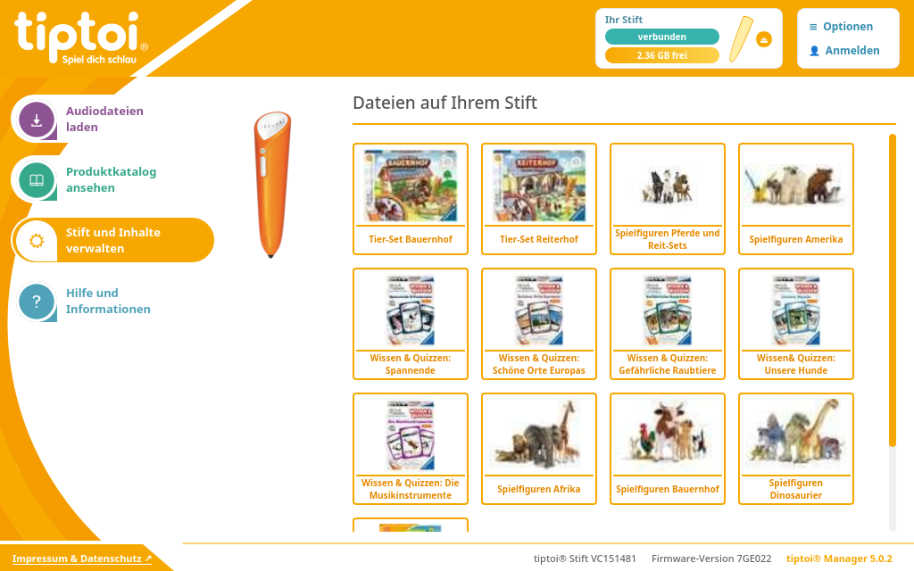
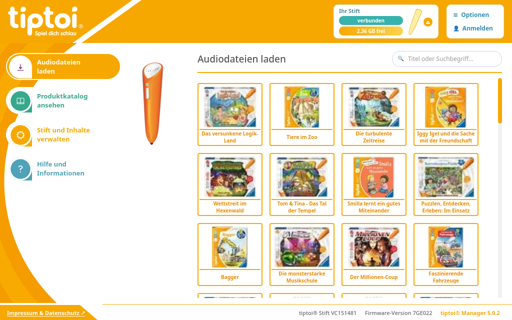
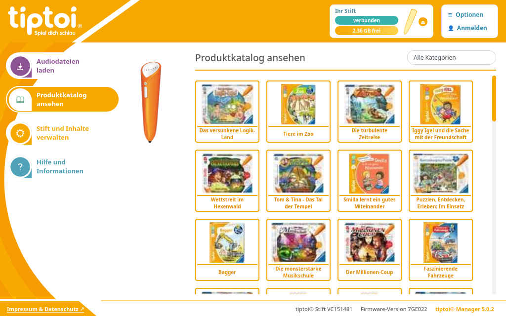
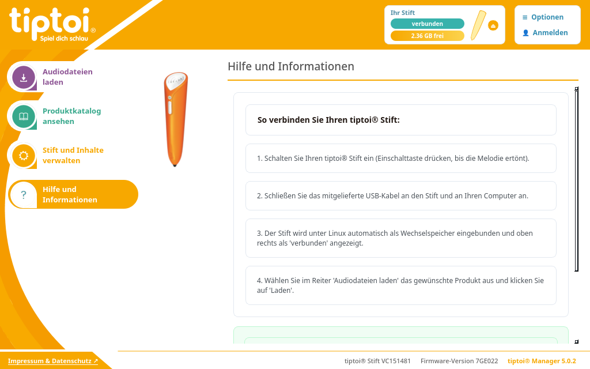

# tiptoi® Manager für Linux (1:1 Reverse Engineered)

[](#-lizenz--urheberrechtshinweis-disclaimer)
[](https://www.python.org/)
[](https://riverbankcomputing.com/software/pyqt/)
[](https://archlinux.org/)

> [!IMPORTANT]
> **Rechtlicher Hinweis & Urheberrecht (Copyright):**
> Bei dieser Anwendung handelt es sich um eine **1:1 Kopie / Nachbildung** der offiziellen Benutzeroberfläche des Ravensburger tiptoi® Managers für Linux-Systeme.
> **Sämtliche Urheberrechte (Copyright) an allen verwendeten Bild-, Ton- und Grafik-Assets (Logos, Icons, Stift-Renderings, Hintergründe, Produktcover) sowie an den Marken *tiptoi®* und *Ravensburger* liegen vollumfänglich und uneingeschränkt bei der Ravensburger Verlag GmbH.**
> Dieses Projekt ist ein privates, inoffizielles Open-Source-Projekt zur Interoperabilität für Linux-Nutzer und steht in keinerlei geschäftlicher oder offizieller Verbindung zur Ravensburger Verlag GmbH.

Ein nativer, pixelgenauer Linux-Port des offiziellen Ravensburger **tiptoi® Managers (v5.2)**.

Erstellt durch vollständiges Reverse Engineering der offiziellen macOS- und Windows-Binärdateien (`Unity 2021.3.30f1` mit `IL2CPP`). Läuft komplett **ohne Wine** oder Virtualisierung direkt unter Linux.

---

## 📸 Screenshots

| Stift & Inhalte verwalten (1:1 Nachbau) | Audiodateien laden & Suche |
| :---: | :---: |
|  |  |

| Produktkatalog ansehen & Filter | Hilfe & Linux-Hinweise |
| :---: | :---: |
|  |  |

---

## 🎯 Warum funktioniert der offizielle Manager nicht unter Wine?

Die Windows- und Mac-Versionen des tiptoi Managers wurden in **Unity** geschrieben. Die Stifterkennung nutzt plattformspezifische native C-Hooks (`TipToiBindings`):
- Unter macOS scannt die Anwendung fest `/Volumes/*/.tiptoi.log`.
- Unter Windows ruft die Anwendung `GetLogicalDriveStrings()` und Windows-Volume-APIs auf und wartet auf Windows `WM_DEVICECHANGE`-Ereignisse.
- **Problem unter Wine**: Wine leitet Linux-USB-Mounts (`/run/media/$USER/...`) oft nicht als echte Wechseldatenträger (`DRIVE_REMOVABLE`) an Unity weiter, und die Hardware-Ereignisse kommen in der Unity-Engine nicht an.

Diese native Linux-Version löst das Problem von Grund auf über native Linux-Systemaufrufe (`/proc/mounts`, udisks2 und standardmäßige Mount-Pfade).

---

## 🔍 Reverse Engineering Erkenntnisse

1. **Stift-Erkennung & Dateisystem**:
   - Jeder tiptoi® Stift formatiert seinen internen Speicher als Standard-FAT/FAT32-Dateisystem.
   - Auf dem Stift liegt eine versteckte Datei `.tiptoi.log` (64 Bytes strukturiert in 4 Blöcke à 16 Bytes: Seriennummer, Firmware-Descriptor, Sprache, MCU-Typ).
   - `.gme`-Dateien haben bei Offset `20` (4 Bytes Little-Endian Integer) ihre eindeutige Produkt-GME-ID und bei Offset `82` (8 Bytes ASCII) die Versionsnummer.

2. **Ravensburger Cloud API**:
   - **OAuth Token**: `POST https://oauth.ravensburger.com/oauth/token` mit `client_credentials`
     - Client-ID: `tiptoi-manager-v2`
     - Client-Secret: `CYmWkYyhY3traWuGd5cHcNV`
   - **Katalog**: `GET https://ttapiv2.ravensburger.com/api/v2/catalog/de-DE` (340+ Produkte, Hörbücher & Lieder)
   - **Konfiguration & Firmware**: `GET https://ttapiv2.ravensburger.com/api/v2/config/de-DE/WIN`
   - **Audiodatei-Downloads**: Direkte, unverschlüsselte Cloudflare-CDN-URLs (`https://ravensburger.cloud/rvwebsite/rvDE/db/applications/...`)

3. **1:1 Design & Original-Assets**:
   - Alle 260 originalen hochauflösenden PNG-Sprites, Logos und Icons wurden direkt aus den Unity-Assets (`sharedassets0.assets`, `resources.assets`) extrahiert.
   - Alle Texte stammen direkt aus der extrahierten `LocalizationFile.txt` von Ravensburger.
   - Exakte Farbwerte: Ravensburger Orange (`#f7a800`), Status Grün/Teal (`#38b2ac`), Anthrazitgrau (`#555555`).

---

## 🚀 Features

- **1:1 Original-Design**:
  - Original gelb-oranger Bogen (`Arch.png`) im linken Bereich.
  - Aufrecht stehende 3D-Illustration des verbundenen tiptoi® Stifts (`PenFullRev14@2x.png` / `PenFullGen2@2x.png`).
  - 4-spaltiges Produktkarten-Grid mit orangem Rahmen (`border: 2px solid #f7a800`) und orangen Titeln.
  - Kapsel „Ihr Stift“ oben rechts mit Verbindungs-Pill, freiem Speicher, Mini-Stiftgrafik und Auswurftaste.
  - Angeschrägter Fußzeilen-Keil mit Impressum & Statusangaben (Seriennummer, Firmware-Version).
- **Automatische USB-Erkennung**: Erkennt angeschlossene tiptoi-Stifte sofort über `/proc/mounts`, `udisks2` und `/run/media`.
- **Manuelle Stift-Auswahl**: Ermöglicht die manuelle Wahl eines beliebigen Stift-Ordners über „≡ Optionen“.
- **Test-Stift Simulation**: Teste den Manager auch ohne physischen Stift mit einem Klick auf `"🧪 Test-Stift"`.
- **Direkter GME-Download**: Lädt Audiodateien mit Fortschrittsbalken direkt auf den Stift.
- **Stift-Inhaltsverwaltung**: Zeigt alle auf dem Stift befindlichen `.gme`-Dateien mit Buchcover, Titel und Speichergröße an und ermöglicht das sichere Löschen.
- **Sicheres Aushängen**: Eject-Button (⏏) für sicheres Trennen des Stifts (`sync` & `udisksctl unmount`).
- **Katalog-Browsing & Filter**: Suche nach Namen, Altersgruppe und Serien/Kategorien.

---

## 📦 Installation unter Arch Linux / Manjaro / CachyOS

Das Repository enthält ein fertiges `PKGBUILD`.

### Mit `makepkg`:

```bash
git clone https://github.com/DomiLuebben/tiptoi-manager-linux.git
cd tiptoi-manager-linux
makepkg -si
```

Nach der Installation steht das Programm systemweit als Befehl `tiptoi-manager` und im Anwendungsmenü zur Verfügung:

```bash
tiptoi-manager
```

### Deinstallation:

```bash
sudo pacman -R tiptoi-manager
```

---

## 💻 Manuelle Ausführung (ohne Installation)

Voraussetzungen:
- Python 3.10+
- PyQt6 (`sudo pacman -S python-pyqt6` bzw. `pip install PyQt6`)
- Requests (`sudo pacman -S python-requests` bzw. `pip install requests`)
- udisks2

Im Projektverzeichnis ausführen:

```bash
./run.sh
```

---

## ⚖️ Lizenz & Urheberrechtshinweis (Disclaimer)

- **1:1 Kopie / Portierung**: Diese Anwendung ist eine rein technische und visuelle 1:1 Nachbildung der Originalsoftware für Linux-Systeme, um tiptoi® Stifte ohne Wine oder Windows betreiben zu können.
- **Copyright der Assets**: **Sämtliche Urheberrechte (Copyright) an allen verwendeten Grafiken, Icons, Sprites, 3D-Stift-Illustrationen, Buchcovern, Produktbeschreibungen, Markenzeichen und Logos liegen allein und uneingeschränkt bei der Ravensburger Verlag GmbH.**
- **Markenrecht**: **tiptoi®** und **Ravensburger** sind eingetragene Schutzmarken der Ravensburger Verlag GmbH.
- **Keine geschäftliche Verbindung**: Dieses Projekt ist ein inoffizielles Community-Projekt und steht in keiner Verbindung zur Ravensburger Verlag GmbH.
- **Zweck**: Ausschließlich private, nicht-kommerzielle Nutzung zur Interoperabilität gemäß § 69e UrhG (Dekompilierung zur Gewährleistung der Interoperabilität eines unabhängig geschaffenen Computerprogramms).
- **Quellcode**: Der eigenständig entwickelte Python-Quellcode steht für Open-Source-Zwecke zur Verfügung.
